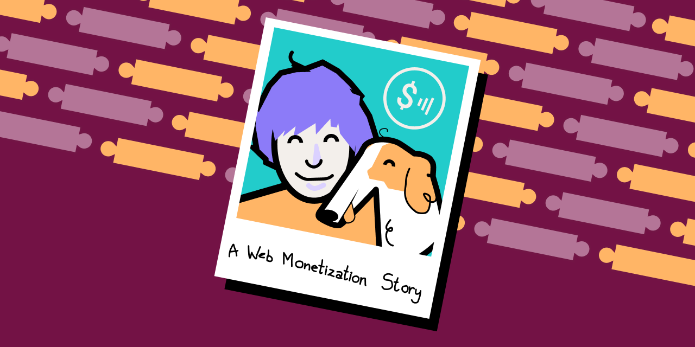

# [**A Web Monetization Story**](https://esse-dev.github.io/a-web-monetization-story/)
An interactive [Web Monetization](https://webmonetization.org/) tutorial for online creators. 
_Project for the [Betahack "Fix the Internet" Hackathon](https://betahack.devpost.com/) (August 17th-30th, 2020)_

**Try it out here:** https://esse-dev.github.io/a-web-monetization-story/

**Demo video:** https://youtu.be/EqZIcUXLZgs

**Devpost submission:** https://devpost.com/software/borzoi

**Drag and Drop Javascript Library:** https://github.com/bevacqua/dragula

---

[**A Web Monetization Story**](https://esse-dev.github.io/a-web-monetization-story/) is a website that 
seeks to help creators understand how simple it is to enable [Web Monetization](https://webmonetization.org/) 
on their own sites. The story of Auden and Chicken aims to engage users and help them relate to — and 
understand the purpose of — Web Monetization. It includes a simple drag-and-drop tutorial to show the basic 
steps needed to get Web Monetization running on a site. We want to make the tutorial easy and fun, and ensure 
it is easily understood by those who are less technical.

A Web Monetization Story starts off with an introduction to Auden, an androgynous creator who recently 
came across Web Monetization and integrated it into their blog. As a digital creator, Auden is always 
looking for new ways to support themself financially. At the same time, Auden wants to make sure that 
readers have a good experience on the site, so integrating ads into Auden's site didn't sit well with 
them. Web Monetization was especially appealing to Auden, not only because it provides a new stream of 
revenue, but also because the community surrounding the concept strongly values openness, fairness and 
inclusivity.

Following their personal introduction, Auden provides step-by-step instructions on how to integrate Web 
Monetization onto a site. For each step, a puzzle piece containing simple code can be dragged and dropped 
by a user into the sample website html provided. Auden provides personal anecdotes about their process in 
enabling Web Monetization on their site, as well as context and reasoning for simple code that is added. 
The tutorial starts off with the basics needed to enable Web Monetization (adding the monetization meta 
tag) and progresses into a further example on how to customize a visitor’s experience on the site using 
the [Web Monetization JavaScript API](https://webmonetization.org/docs/api) (showing a “thank you” note 
to visitors supporting the site via Web Monetization).

The main Web Monetization concepts introduced in the tutorial include: 
- [monetization `<meta>` tag](https://webmonetization.org/docs/getting-started#3-create-your-meta-tag), 
- [Payment Pointer](https://paymentpointers.org/), 
- [Web Monetization Provider](https://webmonetization.org/docs/sending), 
- [Web Monetization Wallet](https://webmonetization.org/docs/ilp-wallets), 
- [`document.monetization` object](https://webmonetization.org/docs/api#documentmonetization), 
- [`‘monetizationprogress’` event and event listener](https://webmonetization.org/docs/api#monetizationprogress), 
- showing/hiding content based on whether a visitor is streaming payment to the site through Web Monetization.

At the end of the tutorial, Auden presents a handful of resources that a user can leverage to continue on 
with Web Monetization and join the Web Monetization community. Users can also download or copy the sample 
code and view the sample code on Github.

Finally, Auden closes out the story with a thank you page and a user can choose to start the story again.

Overall, our project provides an interactive story and tutorial that introduces creators to Web Monetization 
— guiding them through how easy it is to start monetizing a website using Web Monetization.

---

## Resources

- [Getting started with Web Monetization](https://webmonetization.org/docs/getting-started)
- [Web Monetization JavaScript API](https://webmonetization.org/docs/api)
- [Web Monetization Wallets/Payment Pointers](https://webmonetization.org/docs/ilp-wallets#payment-pointers)
- [Simple Web Monetization Example Code](https://github.com/esse-dev/web-monetization-base/blob/master/simple.html)
- [Grant for the Web](https://grantfortheweb.org/)
- [Grant for the Web Community Forum](https://forum.grantfortheweb.org/)

---

## Connect with Us
- DEV
  - [esse-dev](https://dev.to/esse-dev)
  - [Elliot](https://dev.to/elliot)
  - [Sharon](https://dev.to/sharon)
- Twitter
  - [Elliot](https://twitter.com/elliotokay)
  - [Sharon](https://twitter.com/_sharonwang)
